# Hi, I'm Kevin 👋

🚀 Software Engineer | Building scalable systems

🌍 Based in Berlin

## 🧰 Tech Stack
**Languages:** TypeScript, JavaScript, Python, Go, Java  
**Frontend:** React, Next.js, Vue.js, Nuxt.js, Tailwind, ShadcnUI, Playwright  
**Backend:** Node.js, Nest.js, Flask, FastAPI, Gin, Postgres, Redis, ElasticSearch, Mongodb, Kafka  
**DevOps:** Docker, Kubernetes, AWS, CI/CD

---

## 📈 GitHub Stats

